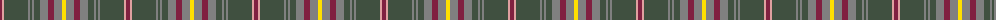

The parent of this is [Tasmanian](/tartans/dr/4/lr2/n24/na2/n2/na2/n6/na8/dr6/na8/y/4/)

This was sourced from weddslist.  It is a [11 stripes tartan](/stripes/stripes11/).

Original link http://www.weddslist.com/cgi-bin/tartans/pg.pl?source=sts

## Thread count
DR/4 LR2 N24 Na2 N2 Na2 N6 Na8 DR6 Na8 Y/4

## Palette
Each colour and its ΔE from the base-6 reference it is a variant of.

| Colour | Shade | Base | ΔE (OKLab) |
|---|---|---|---|
| DR |  `#802040` | R  | 0.16 |
| LR |  `#E0A0A0` | Y  | 0.17 |
| N |  `#405040` | G  | 0.12 |
| Na |  `#808080` | G  | 0.22 |
| Y |  `#FFE000` | Y  | 0.09 |

ID: /variants/dr/4/lr2/n24/na2/n2/na2/n6/na8/dr6/na8/y/4-dr802040-lre0a0a0-n405040-na808080-yffe000/
