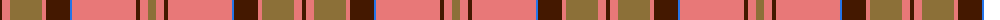

The parent of this is [Wcwm 9275-1626](/tartans/dr/4/lr8/lt32/lr4/dr24/b2/lr64/dr4/lr8/lt/8/)

This was sourced from register-of-tartans.  It is a [10 stripes tartan](/stripes/stripes10/).

Original link https://www.tartanregister.gov.uk/tartanDetails.aspx?ref=4574

## Thread count
DR/4 LR8 LT32 LR4 DR24 B2 LR64 DR4 LR8 LT/8

## Palette
Each colour and its ΔE from the base-6 reference it is a variant of.

| Colour | Shade | Base | ΔE (OKLab) |
|---|---|---|---|
| B |  `#2474E8` | B  | 0.20 |
| DR |  `#441800` | B  | 0.22 |
| LR |  `#E87878` | R  | 0.19 |
| LT |  `#8C7038` | G  | 0.18 |

ID: /variants/dr/4/lr8/lt32/lr4/dr24/b2/lr64/dr4/lr8/lt/8-b2474e8-dr441800-lre87878-lt8c7038/
