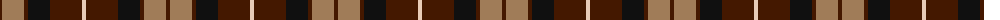
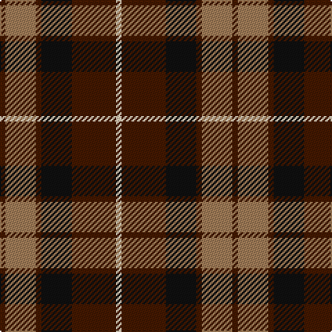

The parent of this is [Portrait, The](/tartans/dr/4/lt22/dr4/k22/dr32/lr/4/)

This was sourced from register-of-tartans.  It is a [6 stripes tartan](/stripes/stripes6/).

Original link https://www.tartanregister.gov.uk/tartanDetails.aspx?ref=3360

## Thread count
DR/4 LT22 DR4 K22 DR32 LR/4

## Palette
Each colour and its ΔE from the base-6 reference it is a variant of.

| Colour | Shade | Base | ΔE (OKLab) |
|---|---|---|---|
| DR |  `#441800` | B  | 0.22 |
| K |  `#101010` | K  | 0.17 |
| LR |  `#E8CCB8` | W  | 0.11 |
| LT |  `#A07C58` | R  | 0.19 |

# Sample pattern

ID: /variants/dr/4/lt22/dr4/k22/dr32/lr/4-dr441800-k101010-lre8ccb8-lta07c58/
