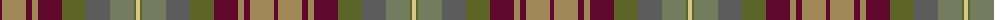

The parent of this is [Auld Scotland](/tartans/dr/4/lt24/dr6/lt6/dr24/ga24/n24/g24/ga2/lg/4/)

This was sourced from register-of-tartans.  It is a [10 stripes tartan](/stripes/stripes10/).

Original link https://www.tartanregister.gov.uk/tartanDetails.aspx?ref=134

## Thread count
DR/4 LT24 DR6 LT6 DR24 Ga24 N24 G24 Ga2 LG/4

## Palette
Each colour and its ΔE from the base-6 reference it is a variant of.

| Colour | Shade | Base | ΔE (OKLab) |
|---|---|---|---|
| DR |  `#60082C` | B  | 0.19 |
| G |  `#747C60` | G  | 0.17 |
| Ga |  `#5C6428` | G  | 0.09 |
| LG |  `#D8C888` | Y  | 0.08 |
| LGa |  `#789484` | G  | 0.23 |
| LT |  `#A08858` | Y  | 0.21 |
| N |  `#5C5C5C` | B  | 0.14 |

ID: /variants/dr/4/lt24/dr6/lt6/dr24/ga24/n24/g24/ga2/lg/4-dr60082c-g747c60-ga5c6428-lgd8c888-lga789484-lta08858-n5c5c5c/
