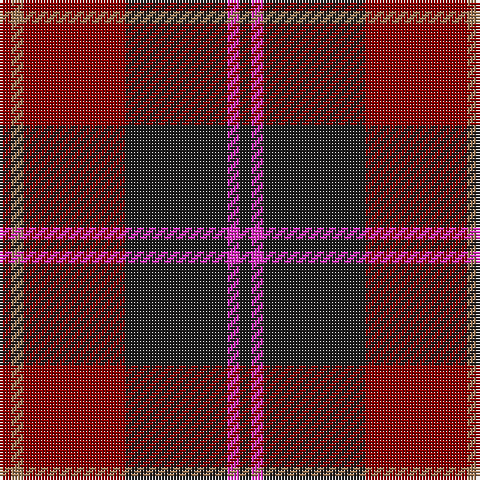

The parent of this is [Eglington](/tartans/dr/4/lt4/dr34/k34/lr4/k/4/)

This was sourced from register-of-tartans.  It is a [6 stripes tartan](/stripes/stripes6/).

Original link https://www.tartanregister.gov.uk/tartanDetails.aspx?ref=1089

## Thread count
DR/4 LT4 DR34 K34 LR4 K/4

## Palette
Each colour and its ΔE from the base-6 reference it is a variant of.

| Colour | Shade | Base | ΔE (OKLab) |
|---|---|---|---|
| DR |  `#880000` | R  | 0.14 |
| K |  `#1C1C1C` | B  | 0.20 |
| LR |  `#EC34C4` | R  | 0.24 |
| LT |  `#A07C58` | R  | 0.19 |

# Sample pattern

ID: /variants/dr/4/lt4/dr34/k34/lr4/k/4-dr880000-k1c1c1c-lrec34c4-lta07c58/
