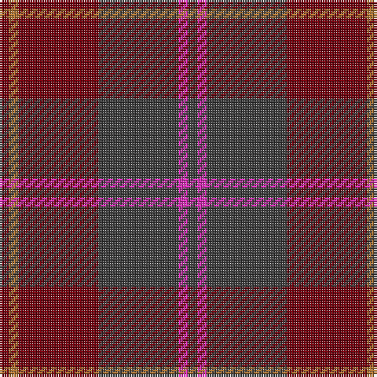

The parent of this is [Cypress (Fashion)](/tartans/dr/4/lt4/dr34/n34/lr4/n/4/)

This was sourced from tartans-authority.  It is a [6 stripes tartan](/stripes/stripes6/).

Original link http://www.tartansauthority.com/tartan-ferret/display/4650/

## Thread count
DR/4 LT4 DR34 N34 LR4 N/4

## Palette
Each colour and its ΔE from the base-6 reference it is a variant of.

| Colour | Shade | Base | ΔE (OKLab) |
|---|---|---|---|
| DR |  `#70000C` | R  | 0.20 |
| LR |  `#E02CB8` | R  | 0.22 |
| LT |  `#B07430` | R  | 0.17 |
| N |  `#3C3C3C` | B  | 0.12 |

# Sample pattern

ID: /variants/dr/4/lt4/dr34/n34/lr4/n/4-dr70000c-lre02cb8-ltb07430-n3c3c3c/
