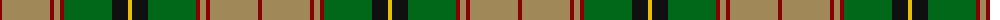
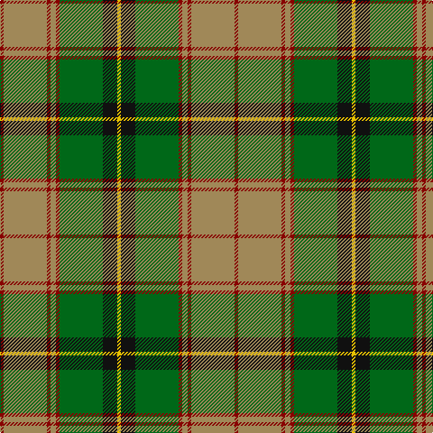

The parent of this is [Botherston (Name)](/tartans/dr/4/lt48/dr4/lt6/dr4/g48/k16/y/4/)

This was sourced from tartans-authority.  It is a [8 stripes tartan](/stripes/stripes8/).

Original link http://www.tartansauthority.com/tartan-ferret/display/8585/

## Thread count
DR/4 LT48 DR4 LT6 DR4 G48 K16 Y/4

## Palette
Each colour and its ΔE from the base-6 reference it is a variant of.

| Colour | Shade | Base | ΔE (OKLab) |
|---|---|---|---|
| DR |  `#880000` | R  | 0.14 |
| G |  `#006818` | G  | 0.02 |
| K |  `#101010` | K  | 0.17 |
| LT |  `#A08858` | Y  | 0.21 |
| Y |  `#E8C000` | Y  | 0.00 |

# Sample pattern

ID: /variants/dr/4/lt48/dr4/lt6/dr4/g48/k16/y/4-dr880000-g006818-k101010-lta08858-ye8c000/
