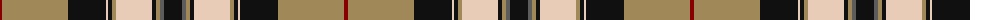

The parent of this is [Pride of Scotland, Gold (Fashion)](/tartans/dr/4/lt66/k38/lr2/k4/lt4/lr36/k4/lt4/n4/k/18/)

This was sourced from tartans-authority.  It is a [11 stripes tartan](/stripes/stripes11/).

Original link http://www.tartansauthority.com/tartan-ferret/display/6478/

## Thread count
DR/4 LT66 K38 LR2 K4 LT4 LR36 K4 LT4 N4 K/18

## Palette
Each colour and its ΔE from the base-6 reference it is a variant of.

| Colour | Shade | Base | ΔE (OKLab) |
|---|---|---|---|
| DR |  `#880000` | R  | 0.14 |
| K |  `#101010` | K  | 0.17 |
| LR |  `#E8CCB8` | W  | 0.11 |
| LT |  `#A08858` | Y  | 0.21 |
| N |  `#5C5C5C` | B  | 0.14 |

ID: /variants/dr/4/lt66/k38/lr2/k4/lt4/lr36/k4/lt4/n4/k/18-dr880000-k101010-lre8ccb8-lta08858-n5c5c5c/
