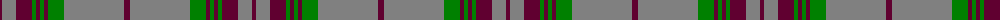

The parent of this is [Gray](/tartans/dr/4/n14/dr16/g4/dr4/g4/dr4/g16/n60/dr/6/)

This was sourced from weddslist.  It is a [10 stripes tartan](/stripes/stripes10/).

Original link http://www.weddslist.com/cgi-bin/tartans/pg.pl?source=sts

## Thread count
DR/4 N14 DR16 G4 DR4 G4 DR4 G16 N60 DR/6

## Palette
Each colour and its ΔE from the base-6 reference it is a variant of.

| Colour | Shade | Base | ΔE (OKLab) |
|---|---|---|---|
| DR |  `#600030` | B  | 0.19 |
| G |  `#008000` | G  | 0.09 |
| N |  `#808080` | G  | 0.22 |

ID: /variants/dr/4/n14/dr16/g4/dr4/g4/dr4/g16/n60/dr/6-dr600030-g008000-n808080/
