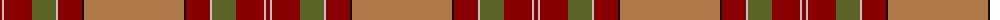
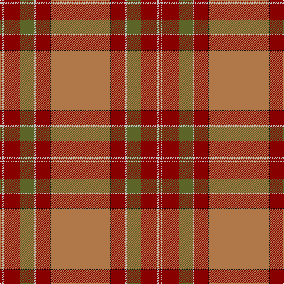

The parent of this is [MacByrd (Personal)](/tartans/dr/4/n2/dr28/g24/n2/dr24/k2/lt/100/)

This was sourced from tartans-authority.  It is a [8 stripes tartan](/stripes/stripes8/).

Original link http://www.tartansauthority.com/tartan-ferret/display/3323/

## Thread count
DR/4 N2 DR28 G24 N2 DR24 K2 LT/100

## Palette
Each colour and its ΔE from the base-6 reference it is a variant of.

| Colour | Shade | Base | ΔE (OKLab) |
|---|---|---|---|
| DR |  `#880000` | R  | 0.14 |
| G |  `#5C6428` | G  | 0.09 |
| K |  `#101010` | K  | 0.17 |
| LT |  `#B07848` | R  | 0.17 |
| N |  `#C0C0C0` | W  | 0.16 |

# Sample pattern

ID: /variants/dr/4/n2/dr28/g24/n2/dr24/k2/lt/100-dr880000-g5c6428-k101010-ltb07848-nc0c0c0/
