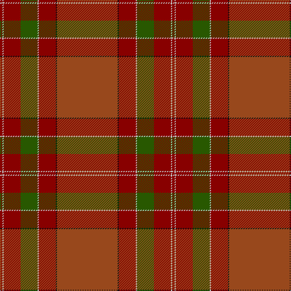

The parent of this is [McBrayer Htg (Personal)](/tartans/dr/4/n2/dr28/g28/n2/dr28/k2/t/100/)

This was sourced from tartans-authority.  It is a [8 stripes tartan](/stripes/stripes8/).

Original link http://www.tartansauthority.com/tartan-ferret/display/3321/

## Thread count
DR/4 N2 DR28 G28 N2 DR28 K2 T/100

## Palette
Each colour and its ΔE from the base-6 reference it is a variant of.

| Colour | Shade | Base | ΔE (OKLab) |
|---|---|---|---|
| DR |  `#880000` | R  | 0.14 |
| G |  `#285800` | G  | 0.04 |
| K |  `#101010` | K  | 0.17 |
| N |  `#C0C0C0` | W  | 0.16 |
| T |  `#98481C` | R  | 0.11 |

# Sample pattern

ID: /variants/dr/4/n2/dr28/g28/n2/dr28/k2/t/100-dr880000-g285800-k101010-nc0c0c0-t98481c/
