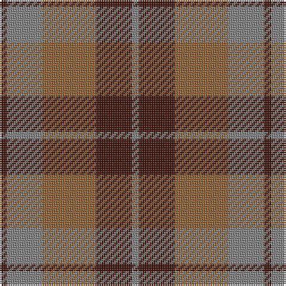

The parent of this is [Harmony 8](/tartans/dr/4/n20/lt30/dr20/n/4/)

This was sourced from weddslist.  It is a [5 stripes tartan](/stripes/stripes5/).

Original link http://www.weddslist.com/cgi-bin/tartans/pg.pl?source=sts

## Thread count
DR/4 N20 LT30 DR20 N/4

## Palette
Each colour and its ΔE from the base-6 reference it is a variant of.

| Colour | Shade | Base | ΔE (OKLab) |
|---|---|---|---|
| DR |  `#401000` | B  | 0.23 |
| LT |  `#906030` | R  | 0.15 |
| N |  `#808080` | G  | 0.22 |

# Sample pattern

ID: /variants/dr/4/n20/lt30/dr20/n/4-dr401000-lt906030-n808080/
