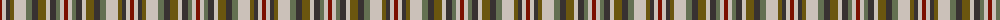

The parent of this is [Callanish, The](/tartans/dr/4/n4/dn4/t4/n12/na6/dn6/t8/n4/dn6/na4/n4/dr/4/)

This was sourced from register-of-tartans.  It is a [13 stripes tartan](/stripes/stripes13/).

Original link https://www.tartanregister.gov.uk/tartanDetails.aspx?ref=10393

## Thread count
DR/4 N4 DN4 T4 N12 Na6 DN6 T8 N4 DN6 Na4 N4 DR/4

## Palette
Each colour and its ΔE from the base-6 reference it is a variant of.

| Colour | Shade | Base | ΔE (OKLab) |
|---|---|---|---|
| DN |  `#383131` | B  | 0.14 |
| DR |  `#7C1000` | R  | 0.16 |
| N |  `#CBC1B9` | W  | 0.15 |
| Na |  `#647052` | G  | 0.14 |
| T |  `#6B560F` | G  | 0.12 |

ID: /variants/dr/4/n4/dn4/t4/n12/na6/dn6/t8/n4/dn6/na4/n4/dr/4-dn383131-dr7c1000-ncbc1b9-na647052-t6b560f/
