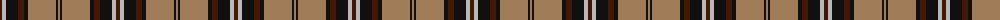
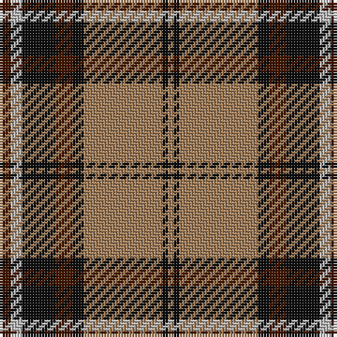

The parent of this is [Blair Atholl (Fashion)](/tartans/dr/4/n4/k12/dr6/k4/lt28/k2/lt/2/)

This was sourced from tartans-authority.  It is a [8 stripes tartan](/stripes/stripes8/).

Original link http://www.tartansauthority.com/tartan-ferret/display/1741/

## Thread count
DR/4 N4 K12 DR6 K4 LT28 K2 LT/2

## Palette
Each colour and its ΔE from the base-6 reference it is a variant of.

| Colour | Shade | Base | ΔE (OKLab) |
|---|---|---|---|
| DR |  `#441800` | B  | 0.22 |
| K |  `#101010` | K  | 0.17 |
| LT |  `#A07C58` | R  | 0.19 |
| N |  `#B8B8B8` | Y  | 0.17 |

# Sample pattern

ID: /variants/dr/4/n4/k12/dr6/k4/lt28/k2/lt/2-dr441800-k101010-lta07c58-nb8b8b8/
