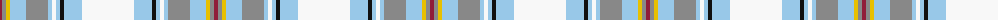

The parent of this is [Manchester Blues Dress (Comm)](/tartans/dr/4/n4/y4/lb16/n22/lb4/w4/lb4/k4/lb18/w/52/)

This was sourced from tartans-authority.  It is a [11 stripes tartan](/stripes/stripes11/).

Original link http://www.tartansauthority.com/tartan-ferret/display/10210/

## Thread count
DR/4 N4 Y4 LB16 N22 LB4 W4 LB4 K4 LB18 W/52

## Palette
Each colour and its ΔE from the base-6 reference it is a variant of.

| Colour | Shade | Base | ΔE (OKLab) |
|---|---|---|---|
| DR |  `#901C38` | R  | 0.12 |
| K |  `#101010` | K  | 0.17 |
| LB |  `#98C8E8` | W  | 0.17 |
| N |  `#888888` | R  | 0.24 |
| W |  `#F8F8F8` | W  | 0.01 |
| Y |  `#E8C000` | Y  | 0.00 |

ID: /variants/dr/4/n4/y4/lb16/n22/lb4/w4/lb4/k4/lb18/w/52-dr901c38-k101010-lb98c8e8-n888888-wf8f8f8-ye8c000/
