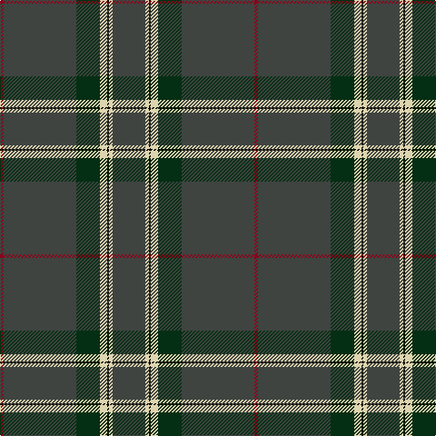

The parent of this is [Puxty-Dunne](/tartans/dr/4/n80/dg26/lr8/k2/lr4/n/36/)

This was sourced from register-of-tartans.  It is a [7 stripes tartan](/stripes/stripes7/).

Original link https://www.tartanregister.gov.uk/tartanDetails.aspx?ref=10533

## Thread count
DR/4 N80 DG26 LR8 K2 LR4 N/36

## Palette
Each colour and its ΔE from the base-6 reference it is a variant of.

| Colour | Shade | Base | ΔE (OKLab) |
|---|---|---|---|
| DG |  `#052F14` | G  | 0.19 |
| DR |  `#89051B` | R  | 0.14 |
| K |  `#120A01` | K  | 0.15 |
| LR |  `#DDD5AF` | W  | 0.11 |
| N |  `#3F4441` | B  | 0.12 |

# Sample pattern

ID: /variants/dr/4/n80/dg26/lr8/k2/lr4/n/36-dg052f14-dr89051b-k120a01-lrddd5af-n3f4441/
