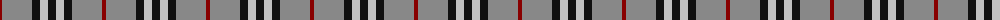
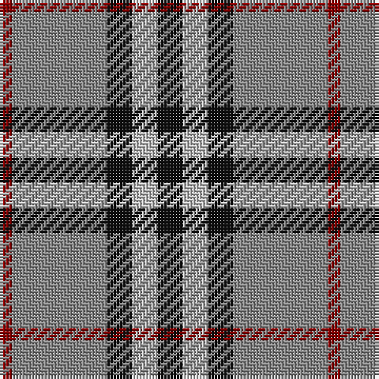

The parent of this is [Oban Grey (Fashion)](/tartans/dr/4/na30/k8/n8/k/8/)

This was sourced from tartans-authority.  It is a [5 stripes tartan](/stripes/stripes5/).

Original link http://www.tartansauthority.com/tartan-ferret/display/1237/

## Thread count
DR/4 Na30 K8 N8 K/8

## Palette
Each colour and its ΔE from the base-6 reference it is a variant of.

| Colour | Shade | Base | ΔE (OKLab) |
|---|---|---|---|
| DR |  `#880000` | R  | 0.14 |
| K |  `#101010` | K  | 0.17 |
| N |  `#C0C0C0` | W  | 0.16 |
| Na |  `#888888` | R  | 0.24 |

# Sample pattern

ID: /variants/dr/4/na30/k8/n8/k/8-dr880000-k101010-nc0c0c0-na888888/
