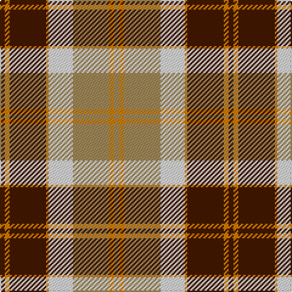

The parent of this is [Bannockbane Trade Tartan Tartan Number: 1743. Earliest known date: pre 2003 The original Bannockbane which was later produced in various colourways See products available Copyright © Blair Urquhart, Comrie, 2015](/tartans/dr/4/o4/dr30/o2/ln20/lt30/o4/lt/4/)

This was sourced from house-of-tartan.  It is a [8 stripes tartan](/stripes/stripes8/).

Original link http://www.house-of-tartan.scotland.net/house/TartanViewjs.asp?colr=Def&tnam=1743

## Thread count
DR/4 O4 DR30 O2 LN20 LT30 O4 LT/4

## Palette
Each colour and its ΔE from the base-6 reference it is a variant of.

| Colour | Shade | Base | ΔE (OKLab) |
|---|---|---|---|
| DR |  `#441800` | B  | 0.22 |
| LN |  `#E0E0E0` | W  | 0.06 |
| LT |  `#A08858` | Y  | 0.21 |
| O |  `#D87C00` | Y  | 0.17 |

# Sample pattern

ID: /variants/dr/4/o4/dr30/o2/ln20/lt30/o4/lt/4-dr441800-lne0e0e0-lta08858-od87c00/
