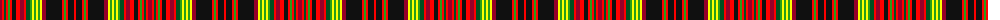

The parent of this is [McNair (2016)](/tartans/dr/4/r2/g2/r2/ga2/r2/k4/r4/dr4/r2/g4/ga2/y2/ga2/y2/ga2/y2/dr4/k16/r2/ga2/r2/k6/r/2/)

This was sourced from register-of-tartans.  It is a [24 stripes tartan](/stripes/stripes24/).

Original link https://www.tartanregister.gov.uk/tartanDetails.aspx?ref=11575

## Thread count
DR/4 R2 G2 R2 Ga2 R2 K4 R4 DR4 R2 G4 Ga2 Y2 Ga2 Y2 Ga2 Y2 DR4 K16 R2 Ga2 R2 K6 R/2

## Palette
Each colour and its ΔE from the base-6 reference it is a variant of.

| Colour | Shade | Base | ΔE (OKLab) |
|---|---|---|---|
| DR |  `#960028` | R  | 0.11 |
| G |  `#005020` | G  | 0.08 |
| Ga |  `#289C18` | G  | 0.18 |
| K |  `#101010` | K  | 0.17 |
| R |  `#FF0000` | R  | 0.11 |
| Y |  `#FFFF00` | Y  | 0.16 |

ID: /variants/dr/4/r2/g2/r2/ga2/r2/k4/r4/dr4/r2/g4/ga2/y2/ga2/y2/ga2/y2/dr4/k16/r2/ga2/r2/k6/r/2-dr960028-g005020-ga289c18-k101010-rff0000-yffff00/
