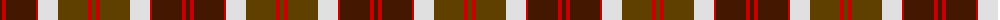

The parent of this is [Bannockbane Brown #1](/tartans/dr/4/r4/dr30/r2/ln20/t30/r4/t/4/)

This was sourced from register-of-tartans.  It is a [8 stripes tartan](/stripes/stripes8/).

Original link https://www.tartanregister.gov.uk/tartanDetails.aspx?ref=196

## Thread count
DR/4 R4 DR30 R2 LN20 T30 R4 T/4

## Palette
Each colour and its ΔE from the base-6 reference it is a variant of.

| Colour | Shade | Base | ΔE (OKLab) |
|---|---|---|---|
| DR |  `#441800` | B  | 0.22 |
| LN |  `#E0E0E0` | W  | 0.06 |
| R |  `#C80000` | R  | 0.00 |
| T |  `#604000` | G  | 0.14 |

# Sample pattern

ID: /variants/dr/4/r4/dr30/r2/ln20/t30/r4/t/4-dr441800-lne0e0e0-rc80000-t604000/
