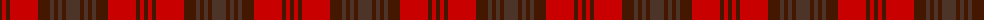

The parent of this is [Wcwm 1155](/tartans/dr/4/r4/dr4/r28/dr12/t4/dr4/t4/dr4/t/14/)

This was sourced from register-of-tartans.  It is a [10 stripes tartan](/stripes/stripes10/).

Original link https://www.tartanregister.gov.uk/tartanDetails.aspx?ref=4512

## Thread count
DR/4 R4 DR4 R28 DR12 T4 DR4 T4 DR4 T/14

## Palette
Each colour and its ΔE from the base-6 reference it is a variant of.

| Colour | Shade | Base | ΔE (OKLab) |
|---|---|---|---|
| DR |  `#441800` | B  | 0.22 |
| R |  `#C80000` | R  | 0.00 |
| T |  `#4C3428` | B  | 0.16 |

ID: /variants/dr/4/r4/dr4/r28/dr12/t4/dr4/t4/dr4/t/14-dr441800-rc80000-t4c3428/
