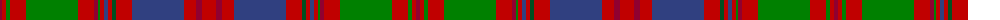

The parent of this is [MacColl, Ancient](/tartans/dr/4/r4/ga4/r16/ga52/r16/dr4/ga2/r4/b4/r4/g4/r16/b52/r12/dr6/r/14/)

This was sourced from weddslist.  It is a [17 stripes tartan](/stripes/stripes17/).

Original link http://www.weddslist.com/cgi-bin/tartans/pg.pl?source=sts

## Thread count
DR/4 R4 Ga4 R16 Ga52 R16 DR4 Ga2 R4 B4 R4 G4 R16 B52 R12 DR6 R/14

## Palette
Each colour and its ΔE from the base-6 reference it is a variant of.

| Colour | Shade | Base | ΔE (OKLab) |
|---|---|---|---|
| B |  `#304080` | B  | 0.01 |
| DR |  `#900030` | R  | 0.13 |
| G |  `#005020` | G  | 0.08 |
| Ga |  `#008000` | G  | 0.09 |
| R |  `#C00000` | R  | 0.02 |

ID: /variants/dr/4/r4/ga4/r16/ga52/r16/dr4/ga2/r4/b4/r4/g4/r16/b52/r12/dr6/r/14-b304080-dr900030-g005020-ga008000-rc00000/
