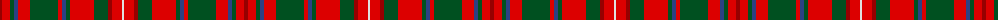

The parent of this is [MacDonald of Staffa #5](/tartans/dr/4/r8/g4/b4/r12/g28/r4/b4/g4/r24/g14/dr4/r10/ln/2/)

This was sourced from register-of-tartans.  It is a [14 stripes tartan](/stripes/stripes14/).

Original link https://www.tartanregister.gov.uk/tartanDetails.aspx?ref=2372

## Thread count
DR/4 R8 G4 B4 R12 G28 R4 B4 G4 R24 G14 DR4 R10 LN/2

## Palette
Each colour and its ΔE from the base-6 reference it is a variant of.

| Colour | Shade | Base | ΔE (OKLab) |
|---|---|---|---|
| B |  `#2C4084` | B  | 0.00 |
| DR |  `#960000` | R  | 0.11 |
| G |  `#005020` | G  | 0.08 |
| LN |  `#E0E0E0` | W  | 0.06 |
| R |  `#DC0000` | R  | 0.04 |

ID: /variants/dr/4/r8/g4/b4/r12/g28/r4/b4/g4/r24/g14/dr4/r10/ln/2-b2c4084-dr960000-g005020-lne0e0e0-rdc0000/
