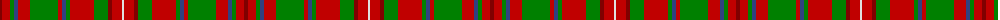

The parent of this is [MacDonald of Staffa 4](/tartans/dr/4/r8/g4/b4/r12/g28/r4/b4/g4/r24/g14/dr4/r10/ln/2/)

This was sourced from weddslist.  It is a [14 stripes tartan](/stripes/stripes14/).

Original link http://www.weddslist.com/cgi-bin/tartans/pg.pl?source=sts

## Thread count
DR/4 R8 G4 B4 R12 G28 R4 B4 G4 R24 G14 DR4 R10 LN/2

## Palette
Each colour and its ΔE from the base-6 reference it is a variant of.

| Colour | Shade | Base | ΔE (OKLab) |
|---|---|---|---|
| B |  `#304080` | B  | 0.01 |
| DR |  `#800000` | R  | 0.16 |
| G |  `#008000` | G  | 0.09 |
| LN |  `#E0E0E0` | W  | 0.06 |
| R |  `#C00000` | R  | 0.02 |

ID: /variants/dr/4/r8/g4/b4/r12/g28/r4/b4/g4/r24/g14/dr4/r10/ln/2-b304080-dr800000-g008000-lne0e0e0-rc00000/
