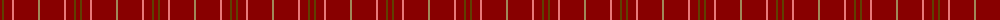

The parent of this is [Killiechassie](/tartans/dr/4/t2/dr8/lr2/dr24/lt/2/)

This was sourced from tartans-authority.  It is a [6 stripes tartan](/stripes/stripes6/).

Original link http://www.tartansauthority.com/tartan-ferret/display/8683/

## Thread count
DR/4 T2 DR8 LR2 DR24 LT/2

## Palette
Each colour and its ΔE from the base-6 reference it is a variant of.

| Colour | Shade | Base | ΔE (OKLab) |
|---|---|---|---|
| DR |  `#880000` | R  | 0.14 |
| LR |  `#E87878` | R  | 0.19 |
| LT |  `#A08858` | Y  | 0.21 |
| T |  `#604000` | G  | 0.14 |

# Sample pattern

ID: /variants/dr/4/t2/dr8/lr2/dr24/lt/2-dr880000-lre87878-lta08858-t604000/
