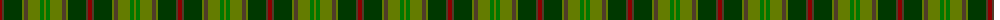
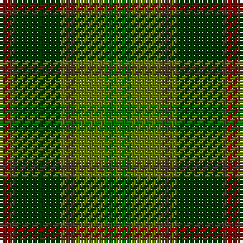

The parent of this is [Tomass](/tartans/dr/4/t2/g18/ga2/t4/ga12/gb4/ga/2/)

This was sourced from register-of-tartans.  It is a [8 stripes tartan](/stripes/stripes8/).

Original link https://www.tartanregister.gov.uk/tartanDetails.aspx?ref=4135

## Thread count
DR/4 T2 G18 Ga2 T4 Ga12 Gb4 Ga/2

## Palette
Each colour and its ΔE from the base-6 reference it is a variant of.

| Colour | Shade | Base | ΔE (OKLab) |
|---|---|---|---|
| DR |  `#8C0000` | R  | 0.13 |
| G |  `#003800` | G  | 0.15 |
| Ga |  `#647C00` | G  | 0.12 |
| Gb |  `#007800` | G  | 0.06 |
| T |  `#503C28` | G  | 0.16 |

# Sample pattern

ID: /variants/dr/4/t2/g18/ga2/t4/ga12/gb4/ga/2-dr8c0000-g003800-ga647c00-gb007800-t503c28/
