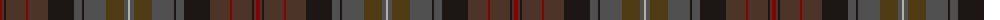

The parent of this is [Bruma](/tartans/dr/4/t2/k2/t20/dr2/t20/k26/n8/k2/n22/ta18/n4/na/2/)

This was sourced from register-of-tartans.  It is a [13 stripes tartan](/stripes/stripes13/).

Original link https://www.tartanregister.gov.uk/tartanDetails.aspx?ref=11571

## Thread count
DR/4 T2 K2 T20 DR2 T20 K26 N8 K2 N22 Ta18 N4 Na/2

## Palette
Each colour and its ΔE from the base-6 reference it is a variant of.

| Colour | Shade | Base | ΔE (OKLab) |
|---|---|---|---|
| DR |  `#880000` | R  | 0.14 |
| K |  `#1C1714` | K  | 0.21 |
| N |  `#505050` | B  | 0.12 |
| Na |  `#B0B0B0` | Y  | 0.18 |
| T |  `#4C3428` | B  | 0.16 |
| Ta |  `#503C14` | G  | 0.15 |

ID: /variants/dr/4/t2/k2/t20/dr2/t20/k26/n8/k2/n22/ta18/n4/na/2-dr880000-k1c1714-n505050-nab0b0b0-t4c3428-ta503c14/
