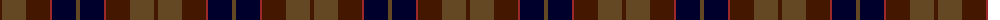
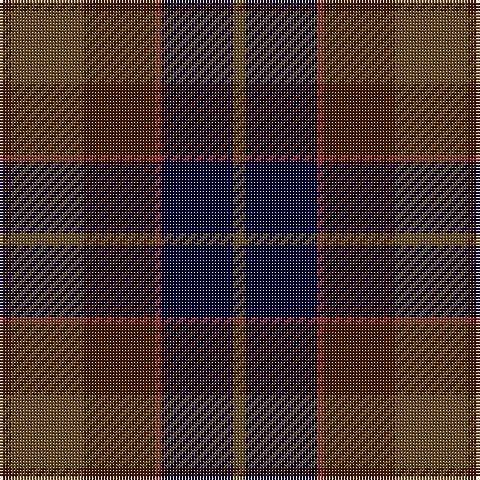

The parent of this is [Ferguson Britt (Corporate)](/tartans/dr/4/t24/dr24/dra2/db24/t/4/)

This was sourced from tartans-authority.  It is a [6 stripes tartan](/stripes/stripes6/).

Original link http://www.tartansauthority.com/tartan-ferret/display/7632/

## Thread count
DR/4 T24 DR24 DRa2 DB24 T/4

## Palette
Each colour and its ΔE from the base-6 reference it is a variant of.

| Colour | Shade | Base | ΔE (OKLab) |
|---|---|---|---|
| DB |  `#00002C` | K  | 0.16 |
| DR |  `#441800` | B  | 0.22 |
| DRa |  `#9C2828` | R  | 0.09 |
| T |  `#644824` | G  | 0.14 |

# Sample pattern

ID: /variants/dr/4/t24/dr24/dra2/db24/t/4-db00002c-dr441800-dra9c2828-t644824/
