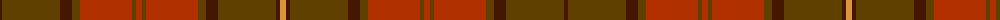

The parent of this is [Hyland Day (Personal)](/tartans/dr/4/t58/dr12/ta8/r52/ta4/r6/ta4/r52/ta8/dr12/t58/dr4/o/6/)

This was sourced from register-of-tartans.  It is a [14 stripes tartan](/stripes/stripes14/).

Original link https://www.tartanregister.gov.uk/tartanDetails.aspx?ref=1804

## Thread count
DR/4 T58 DR12 Ta8 R52 Ta4 R6 Ta4 R52 Ta8 DR12 T58 DR4 O/6

## Palette
Each colour and its ΔE from the base-6 reference it is a variant of.

| Colour | Shade | Base | ΔE (OKLab) |
|---|---|---|---|
| DR |  `#441800` | B  | 0.22 |
| O |  `#DC943C` | Y  | 0.12 |
| R |  `#B03000` | R  | 0.05 |
| T |  `#604000` | G  | 0.14 |
| Ta |  `#604000` | G  | 0.14 |

ID: /variants/dr/4/t58/dr12/ta8/r52/ta4/r6/ta4/r52/ta8/dr12/t58/dr4/o/6-dr441800-odc943c-rb03000-t604000-ta604000/
