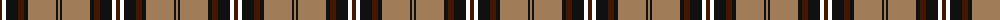
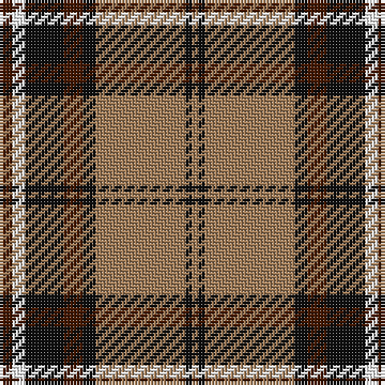

The parent of this is [Braemar or Blair Atholl](/tartans/dr/4/w4/k12/dr6/k4/lt28/k2/lt/2/)

This was sourced from register-of-tartans.  It is a [8 stripes tartan](/stripes/stripes8/).

Original link https://www.tartanregister.gov.uk/tartanDetails.aspx?ref=335

## Thread count
DR/4 W4 K12 DR6 K4 LT28 K2 LT/2

## Palette
Each colour and its ΔE from the base-6 reference it is a variant of.

| Colour | Shade | Base | ΔE (OKLab) |
|---|---|---|---|
| DR |  `#441800` | B  | 0.22 |
| K |  `#101010` | K  | 0.17 |
| LT |  `#A07C58` | R  | 0.19 |
| W |  `#FFFFFF` | W  | 0.03 |

# Sample pattern

ID: /variants/dr/4/w4/k12/dr6/k4/lt28/k2/lt/2-dr441800-k101010-lta07c58-wffffff/
