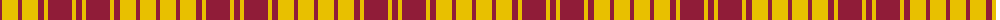

The parent of this is [MacMillan - 1842 (Dress)](/tartans/dr/4/y16/dr4/y16/dr6/y4/dr24/y4/dr/6/)

This was sourced from tartans-authority.  It is a [9 stripes tartan](/stripes/stripes9/).

Original link http://www.tartansauthority.com/tartan-ferret/display/1723/

## Thread count
DR/4 Y16 DR4 Y16 DR6 Y4 DR24 Y4 DR/6

## Palette
Each colour and its ΔE from the base-6 reference it is a variant of.

| Colour | Shade | Base | ΔE (OKLab) |
|---|---|---|---|
| DR |  `#901C38` | R  | 0.12 |
| Y |  `#E8C000` | Y  | 0.00 |

ID: /variants/dr/4/y16/dr4/y16/dr6/y4/dr24/y4/dr/6-dr901c38-ye8c000/
