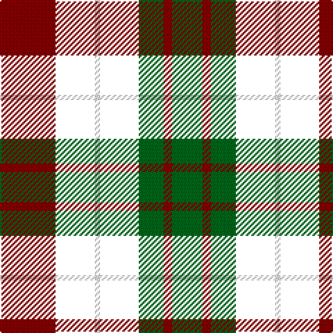

The parent of this is [Brough Family Tartan Tartan Number: 2233. Earliest known date: 1992 A Sinclair variation registered with TECA 17 Oct 1992 by David Brough Benton. His grandfather's (John Brough) tartan dating back to the 1830's. was reconstructed by Eric Swinn of Ocala Florida and handwoven by Peter MacDonald, Perthshire. See products available Copyright © Blair Urquhart, Comrie, 2015](/tartans/dr/40/nb28/w4/nb28/g18/dr6/g/22/)

This was sourced from house-of-tartan.  It is a [7 stripes tartan](/stripes/stripes7/).

Original link http://www.house-of-tartan.scotland.net/house/TartanViewjs.asp?colr=Def&tnam=2233

## Thread count
DR/40 NB28 W4 NB28 G18 DR6 G/22

## Palette
Each colour and its ΔE from the base-6 reference it is a variant of.

| Colour | Shade | Base | ΔE (OKLab) |
|---|---|---|---|
| DB |  `#202060` | B  | 0.11 |
| DG |  `#003820` | G  | 0.16 |
| DR |  `#880000` | R  | 0.14 |
| G |  `#006818` | G  | 0.02 |
| R |  `#C80000` | R  | 0.00 |
| W |  `#FCFCFC` | W  | 0.03 |
| Wa |  `#FCFCFC` | W  | 0.03 |

# Sample pattern

ID: /variants/dr/40/nb28/w4/nb28/g18/dr6/g/22-db202060-dg003820-dr880000-g006818-rc80000-wfcfcfc-wafcfcfc/
