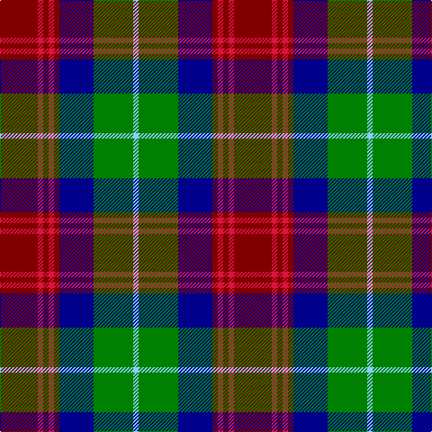

The parent of this is [Akins Clan (Personal)](/tartans/dr/42/r6/dr6/r6/dr6/db38/g44/lb/6/)

This was sourced from register-of-tartans.  It is a [8 stripes tartan](/stripes/stripes8/).

Original link https://www.tartanregister.gov.uk/tartanDetails.aspx?ref=33

## Thread count
DR/42 R6 DR6 R6 DR6 DB38 G44 LB/6

## Palette
Each colour and its ΔE from the base-6 reference it is a variant of.

| Colour | Shade | Base | ΔE (OKLab) |
|---|---|---|---|
| DB |  `#00008B` | B  | 0.14 |
| DR |  `#800000` | R  | 0.16 |
| G |  `#008000` | G  | 0.09 |
| LB |  `#87CEFA` | W  | 0.18 |
| R |  `#DC143C` | R  | 0.06 |

# Sample pattern

ID: /variants/dr/42/r6/dr6/r6/dr6/db38/g44/lb/6-db00008b-dr800000-g008000-lb87cefa-rdc143c/
