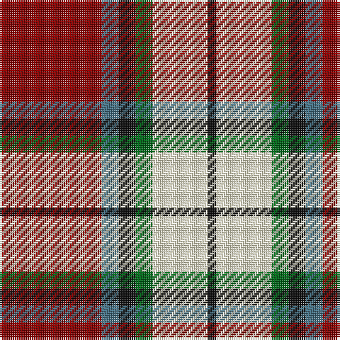

The parent of this is [Rose White Dress](/tartans/dr/48/b8/k8/g8/ly26/k/4/)

This was sourced from tartans-authority.  It is a [6 stripes tartan](/stripes/stripes6/).

Original link http://www.tartansauthority.com/tartan-ferret/display/1227/

## Thread count
DR/48 B8 K8 G8 LY26 K/4

## Palette
Each colour and its ΔE from the base-6 reference it is a variant of.

| Colour | Shade | Base | ΔE (OKLab) |
|---|---|---|---|
| B |  `#447084` | B  | 0.15 |
| DR |  `#880000` | R  | 0.14 |
| G |  `#006818` | G  | 0.02 |
| K |  `#101010` | K  | 0.17 |
| LY |  `#F8F4D0` | W  | 0.04 |

# Sample pattern

ID: /variants/dr/48/b8/k8/g8/ly26/k/4-b447084-dr880000-g006818-k101010-lyf8f4d0/
