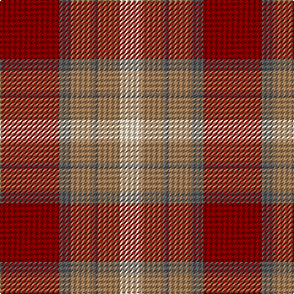

The parent of this is [Plaid Wine](/tartans/dr/48/n10/lt18/n4/lt18/lr/18/)

This was sourced from register-of-tartans.  It is a [6 stripes tartan](/stripes/stripes6/).

Original link https://www.tartanregister.gov.uk/tartanDetails.aspx?ref=3345

## Thread count
DR/48 N10 LT18 N4 LT18 LR/18

## Palette
Each colour and its ΔE from the base-6 reference it is a variant of.

| Colour | Shade | Base | ΔE (OKLab) |
|---|---|---|---|
| DR |  `#880000` | R  | 0.14 |
| LR |  `#E8CCB8` | W  | 0.11 |
| LT |  `#A07C58` | R  | 0.19 |
| N |  `#5C5C5C` | B  | 0.14 |

# Sample pattern

ID: /variants/dr/48/n10/lt18/n4/lt18/lr/18-dr880000-lre8ccb8-lta07c58-n5c5c5c/
