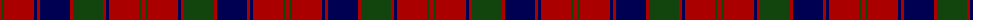

The parent of this is [Robertson D](/tartans/dr/5/dg2/dr30/db3/dr3/db30/dr3/dg30/dr3/db3/dr30/dg2/dr/5/)

This was sourced from weddslist.  It is a [13 stripes tartan](/stripes/stripes13/).

Original link http://www.weddslist.com/cgi-bin/tartans/pg.pl?source=x

## Thread count
DR/5 DG2 DR30 DB3 DR3 DB30 DR3 DG30 DR3 DB3 DR30 DG2 DR/5

## Palette
Each colour and its ΔE from the base-6 reference it is a variant of.

| Colour | Shade | Base | ΔE (OKLab) |
|---|---|---|---|
| DB |  `#000052` | B  | 0.20 |
| DG |  `#11450D` | G  | 0.10 |
| DR |  `#AA0000` | R  | 0.06 |

ID: /variants/dr/5/dg2/dr30/db3/dr3/db30/dr3/dg30/dr3/db3/dr30/dg2/dr/5-db000052-dg11450d-draa0000/
