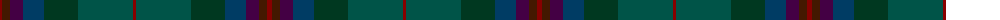
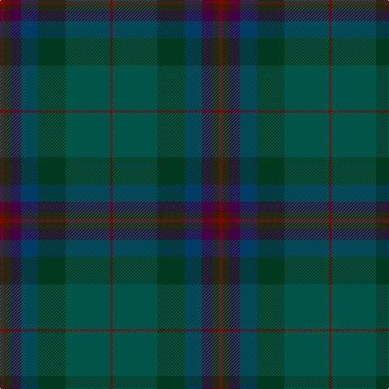

The parent of this is [Uitwaaien Papi (Personal)](/tartans/dr/5/dra8/dp13/db21/dg34/g55/dr/3/)

This was sourced from tartans-authority.  It is a [7 stripes tartan](/stripes/stripes7/).

Original link http://www.tartansauthority.com/tartan-ferret/display/7007/

## Thread count
DR/5 DRa8 DP13 DB21 DG34 G55 DR/3

## Palette
Each colour and its ΔE from the base-6 reference it is a variant of.

| Colour | Shade | Base | ΔE (OKLab) |
|---|---|---|---|
| DB |  `#003C64` | B  | 0.07 |
| DG |  `#003820` | G  | 0.16 |
| DP |  `#440044` | B  | 0.17 |
| DR |  `#880000` | R  | 0.14 |
| DRa |  `#441800` | B  | 0.22 |
| G |  `#005448` | G  | 0.11 |

# Sample pattern

ID: /variants/dr/5/dra8/dp13/db21/dg34/g55/dr/3-db003c64-dg003820-dp440044-dr880000-dra441800-g005448/
