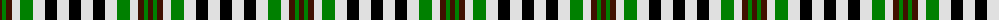

The parent of this is [Burns Heritage Check](/tartans/dr/5/g4/dr6/ln8/g13/ln12/k12/ln12/k/12/)

This was sourced from weddslist.  It is a [9 stripes tartan](/stripes/stripes9/).

Original link http://www.weddslist.com/cgi-bin/tartans/pg.pl?source=sts

## Thread count
DR/5 G4 DR6 LN8 G13 LN12 K12 LN12 K/12

## Palette
Each colour and its ΔE from the base-6 reference it is a variant of.

| Colour | Shade | Base | ΔE (OKLab) |
|---|---|---|---|
| DR |  `#401000` | B  | 0.23 |
| G |  `#008000` | G  | 0.09 |
| K |  `#000000` | K  | 0.00 |
| LN |  `#E0E0E0` | W  | 0.06 |

ID: /variants/dr/5/g4/dr6/ln8/g13/ln12/k12/ln12/k/12-dr401000-g008000-k000000-lne0e0e0/
