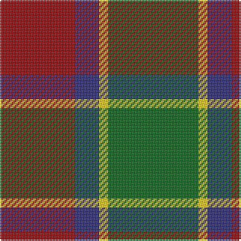

The parent of this is [Dohmen (Personal)](/tartans/dr/50/db16/y6/g/60/)

This was sourced from tartans-authority.  It is a [4 stripes tartan](/stripes/stripes4/).

Original link http://www.tartansauthority.com/tartan-ferret/display/10665/

## Thread count
DR/50 DB16 Y6 G/60

## Palette
Each colour and its ΔE from the base-6 reference it is a variant of.

| Colour | Shade | Base | ΔE (OKLab) |
|---|---|---|---|
| DB |  `#2C2C80` | B  | 0.05 |
| DR |  `#A00000` | R  | 0.09 |
| G |  `#006818` | G  | 0.02 |
| Y |  `#FCCC00` | Y  | 0.04 |

# Sample pattern

ID: /variants/dr/50/db16/y6/g/60-db2c2c80-dra00000-g006818-yfccc00/
