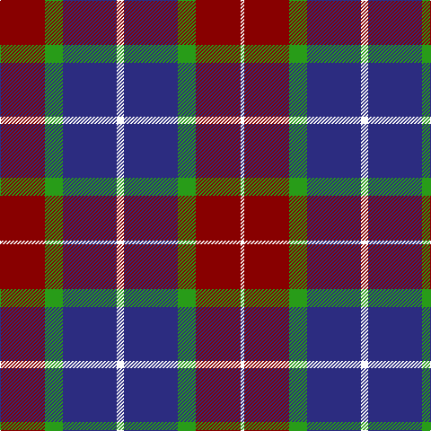

The parent of this is [Highland Spring Dress (2004)](/tartans/dr/50/g20/db60/w8/db60/g20/dr50/w/4/)

This was sourced from register-of-tartans.  It is a [8 stripes tartan](/stripes/stripes8/).

Original link https://www.tartanregister.gov.uk/tartanDetails.aspx?ref=1722

## Thread count
DR/50 G20 DB60 W8 DB60 G20 DR50 W/4

## Palette
Each colour and its ΔE from the base-6 reference it is a variant of.

| Colour | Shade | Base | ΔE (OKLab) |
|---|---|---|---|
| B |  `#1474B4` | B  | 0.15 |
| DB |  `#2C2C80` | B  | 0.05 |
| DR |  `#880000` | R  | 0.14 |
| G |  `#289C18` | G  | 0.18 |
| W |  `#FCFCFC` | W  | 0.03 |

# Sample pattern

ID: /variants/dr/50/g20/db60/w8/db60/g20/dr50/w/4-b1474b4-db2c2c80-dr880000-g289c18-wfcfcfc/
