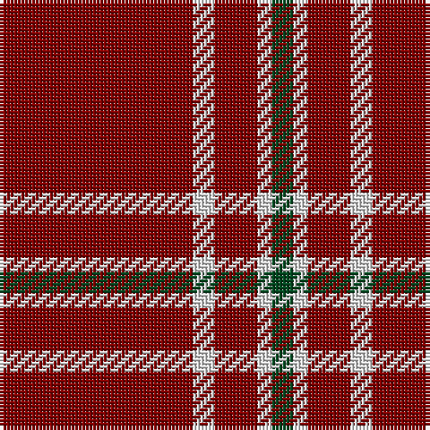

The parent of this is [Martin Family, Robert N Personal Tartan Tartan Number: 10481. Earliest known date: 2011 May This tartan was designed to honour Robert Nunley Martin. The maroon and white colours represent Texas A&M University where Robert Nunley Martin (and his grandson, Ian Thomas Martin) were educated. The dark green represents Baylor University where Robert's mother, Vernon Nunley Martin, and his grandson, Ryan Len Martin graduated. See products available Copyright © Blair Urquhart, Comrie, 2015](/tartans/dr/54/ln6/dr12/ln4/ga/6/)

This was sourced from house-of-tartan.  It is a [5 stripes tartan](/stripes/stripes5/).

Original link http://www.house-of-tartan.scotland.net/house/TartanViewjs.asp?colr=Def&tnam=10481

## Thread count
DR/54 LN6 DR12 LN4 Ga/6

## Palette
Each colour and its ΔE from the base-6 reference it is a variant of.

| Colour | Shade | Base | ΔE (OKLab) |
|---|---|---|---|
| DR |  `#800000` | R  | 0.16 |
| DRa |  `#901C38` | R  | 0.12 |
| G |  `#004820` | G  | 0.10 |
| Ga |  `#004820` | G  | 0.10 |
| LN |  `#E0E0E0` | W  | 0.06 |

# Sample pattern

ID: /variants/dr/54/ln6/dr12/ln4/ga/6-dr800000-dra901c38-g004820-ga004820-lne0e0e0/
