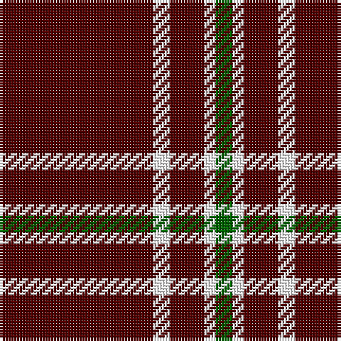

The parent of this is [Martin Family, Robert N (Personal)](/tartans/dr/54/w6/dr12/w4/g/6/)

This was sourced from register-of-tartans.  It is a [5 stripes tartan](/stripes/stripes5/).

Original link https://www.tartanregister.gov.uk/tartanDetails.aspx?ref=10481

## Thread count
DR/54 W6 DR12 W4 G/6

## Palette
Each colour and its ΔE from the base-6 reference it is a variant of.

| Colour | Shade | Base | ΔE (OKLab) |
|---|---|---|---|
| DR |  `#500000` | B  | 0.23 |
| G |  `#006400` | G  | 0.00 |
| W |  `#FFFFFF` | W  | 0.03 |

# Sample pattern

ID: /variants/dr/54/w6/dr12/w4/g/6-dr500000-g006400-wffffff/
