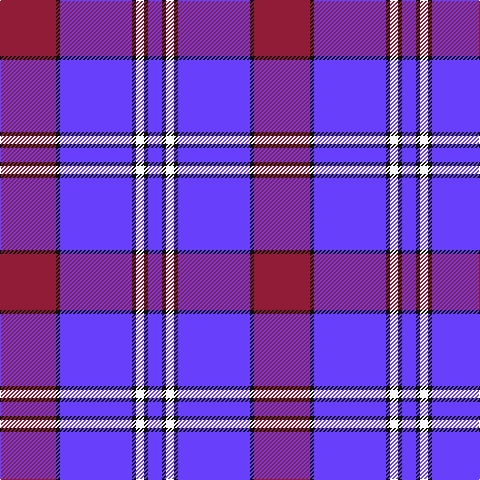

The parent of this is [Presbyterian College Band (Corp)](/tartans/dr/56/k4/p72/k4/w8/k4/p/14/)

This was sourced from tartans-authority.  It is a [7 stripes tartan](/stripes/stripes7/).

Original link http://www.tartansauthority.com/tartan-ferret/display/7674/

## Thread count
DR/56 K4 P72 K4 W8 K4 P/14

## Palette
Each colour and its ΔE from the base-6 reference it is a variant of.

| Colour | Shade | Base | ΔE (OKLab) |
|---|---|---|---|
| DR |  `#901C38` | R  | 0.12 |
| K |  `#101010` | K  | 0.17 |
| P |  `#6840FC` | B  | 0.21 |
| W |  `#F8F8F8` | W  | 0.01 |

# Sample pattern

ID: /variants/dr/56/k4/p72/k4/w8/k4/p/14-dr901c38-k101010-p6840fc-wf8f8f8/
