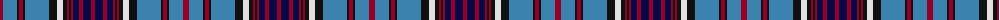

The parent of this is [Royal Canadian Air Force #2](/tartans/dr/6/b14/k2/dr4/k2/b24/k8/ln6/k4/dr2/k2/dr2/db6/dr4/db8/dr/4/)

This was sourced from register-of-tartans.  It is a [16 stripes tartan](/stripes/stripes16/).

Original link https://www.tartanregister.gov.uk/tartanDetails.aspx?ref=3592

## Thread count
DR/6 B14 K2 DR4 K2 B24 K8 LN6 K4 DR2 K2 DR2 DB6 DR4 DB8 DR/4

## Palette
Each colour and its ΔE from the base-6 reference it is a variant of.

| Colour | Shade | Base | ΔE (OKLab) |
|---|---|---|---|
| B |  `#3C82AF` | B  | 0.20 |
| DB |  `#080848` | B  | 0.19 |
| DR |  `#960028` | R  | 0.11 |
| K |  `#101010` | K  | 0.17 |
| LN |  `#E0E0E0` | W  | 0.06 |

ID: /variants/dr/6/b14/k2/dr4/k2/b24/k8/ln6/k4/dr2/k2/dr2/db6/dr4/db8/dr/4-b3c82af-db080848-dr960028-k101010-lne0e0e0/
