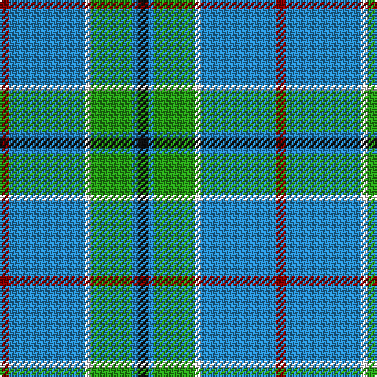

The parent of this is [Vance (Name?)](/tartans/dr/6/b48/ln4/g26/b4/k/6/)

This was sourced from tartans-authority.  It is a [6 stripes tartan](/stripes/stripes6/).

Original link http://www.tartansauthority.com/tartan-ferret/display/2208/

## Thread count
DR/6 B48 LN4 G26 B4 K/6

## Palette
Each colour and its ΔE from the base-6 reference it is a variant of.

| Colour | Shade | Base | ΔE (OKLab) |
|---|---|---|---|
| B |  `#2888C4` | B  | 0.21 |
| DR |  `#880000` | R  | 0.14 |
| G |  `#289C18` | G  | 0.18 |
| K |  `#101010` | K  | 0.17 |
| LN |  `#E0E0E0` | W  | 0.06 |

# Sample pattern

ID: /variants/dr/6/b48/ln4/g26/b4/k/6-b2888c4-dr880000-g289c18-k101010-lne0e0e0/
