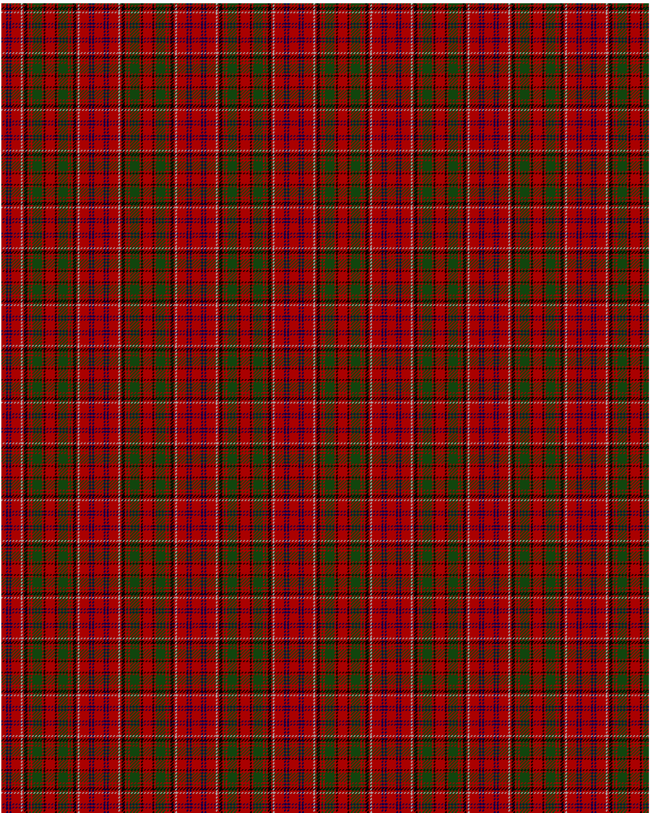

The parent of this is [Drummond C](/tartans/dr/6/db2/dr2/db2/dr12/n2/dr2/k4/dr2/dg2/dr2/dg12/dr2/k2/dr/6/)

This was sourced from <no value>.  It is a [15 stripes tartan](/stripes/stripes15/).

Original link http://www.weddslist.com/cgi-bin/tartans/pg.pl?source=tinsel

## Thread count
DR/6 DB2 DR2 DB2 DR12 N2 DR2 K4 DR2 DG2 DR2 DG12 DR2 K2 DR/6

## Palette
DB DG DR K N

# Sample pattern

ID: /variants/dr/6/db2/dr2/db2/dr12/n2/dr2/k4/dr2/dg2/dr2/dg12/dr2/k2/dr/6-db000052-dg11450d-draa0000-k000000-naaaaaa/