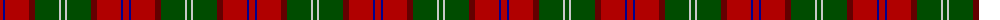
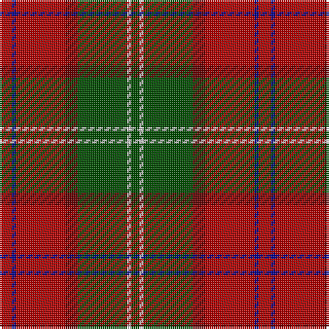

The parent of this is [Leckie (Personal)](/tartans/dr/6/db2/dr24/dra6/g24/n2/g/4/)

This was sourced from tartans-authority.  It is a [7 stripes tartan](/stripes/stripes7/).

Original link http://www.tartansauthority.com/tartan-ferret/display/5405/

## Thread count
DR/6 DB2 DR24 DRa6 G24 N2 G/4

## Palette
Each colour and its ΔE from the base-6 reference it is a variant of.

| Colour | Shade | Base | ΔE (OKLab) |
|---|---|---|---|
| DB |  `#00008C` | B  | 0.13 |
| DR |  `#B00000` | R  | 0.05 |
| DRa |  `#640000` | R  | 0.22 |
| G |  `#004C00` | G  | 0.08 |
| N |  `#C8C8C8` | W  | 0.13 |

# Sample pattern

ID: /variants/dr/6/db2/dr24/dra6/g24/n2/g/4-db00008c-drb00000-dra640000-g004c00-nc8c8c8/
