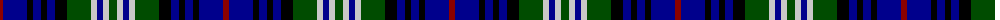

The parent of this is [Scotch House (Dalgliesh)](/tartans/dr/6/db24/k6/db8/k6/db8/k12/g24/n6/db6/n6/g/8/)

This was sourced from register-of-tartans.  It is a [12 stripes tartan](/stripes/stripes12/).

Original link https://www.tartanregister.gov.uk/tartanDetails.aspx?ref=3667

## Thread count
DR/6 DB24 K6 DB8 K6 DB8 K12 G24 N6 DB6 N6 G/8

## Palette
Each colour and its ΔE from the base-6 reference it is a variant of.

| Colour | Shade | Base | ΔE (OKLab) |
|---|---|---|---|
| DB |  `#00008C` | B  | 0.13 |
| DR |  `#8C0000` | R  | 0.13 |
| G |  `#004C00` | G  | 0.08 |
| K |  `#000000` | K  | 0.00 |
| N |  `#C8C8C8` | W  | 0.13 |

ID: /variants/dr/6/db24/k6/db8/k6/db8/k12/g24/n6/db6/n6/g/8-db00008c-dr8c0000-g004c00-k000000-nc8c8c8/
