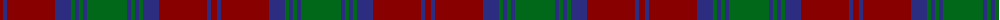

The parent of this is [Lindsay (Clan)](/tartans/dr/6/db4/dr48/db16/g4/db4/g4/db4/g/40/)

This was sourced from tartans-authority.  It is a [9 stripes tartan](/stripes/stripes9/).

Original link http://www.tartansauthority.com/tartan-ferret/display/704/

## Thread count
DR/6 DB4 DR48 DB16 G4 DB4 G4 DB4 G/40

## Palette
Each colour and its ΔE from the base-6 reference it is a variant of.

| Colour | Shade | Base | ΔE (OKLab) |
|---|---|---|---|
| DB |  `#2C2C80` | B  | 0.05 |
| DR |  `#880000` | R  | 0.14 |
| G |  `#006818` | G  | 0.02 |

ID: /variants/dr/6/db4/dr48/db16/g4/db4/g4/db4/g/40-db2c2c80-dr880000-g006818/
