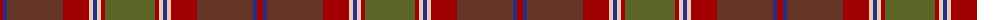

The parent of this is [Brousseau (Personal)](/tartans/dr/6/db4/t56/dr26/lr4/db4/lr4/dr4/g/50/)

This was sourced from tartans-authority.  It is a [9 stripes tartan](/stripes/stripes9/).

Original link http://www.tartansauthority.com/tartan-ferret/display/8907/

## Thread count
DR/6 DB4 T56 DR26 LR4 DB4 LR4 DR4 G/50

## Palette
Each colour and its ΔE from the base-6 reference it is a variant of.

| Colour | Shade | Base | ΔE (OKLab) |
|---|---|---|---|
| DB |  `#2C2C80` | B  | 0.05 |
| DR |  `#A00000` | R  | 0.09 |
| G |  `#5C6428` | G  | 0.09 |
| LR |  `#E8CCB8` | W  | 0.11 |
| T |  `#643424` | B  | 0.17 |

ID: /variants/dr/6/db4/t56/dr26/lr4/db4/lr4/dr4/g/50-db2c2c80-dra00000-g5c6428-lre8ccb8-t643424/
